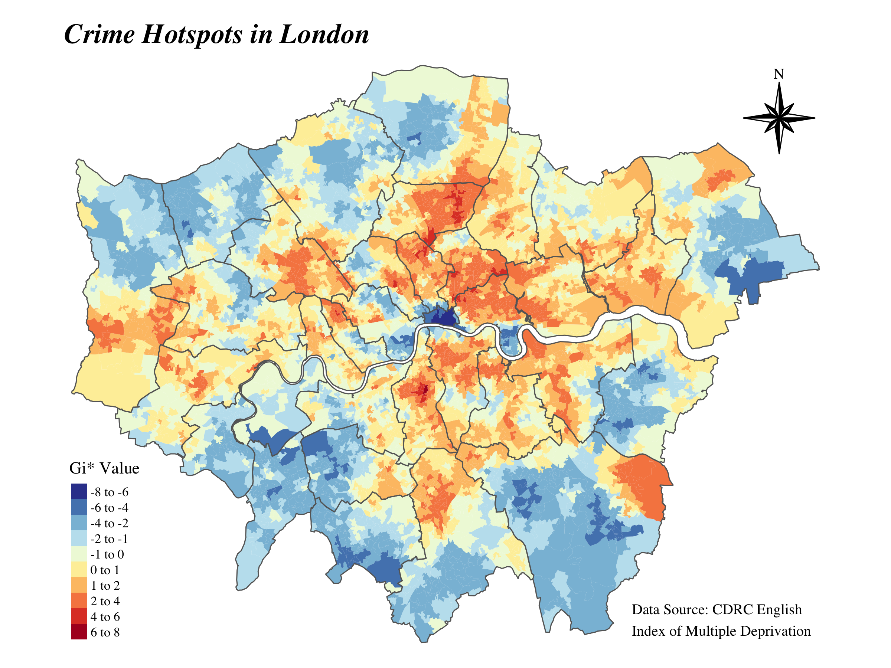
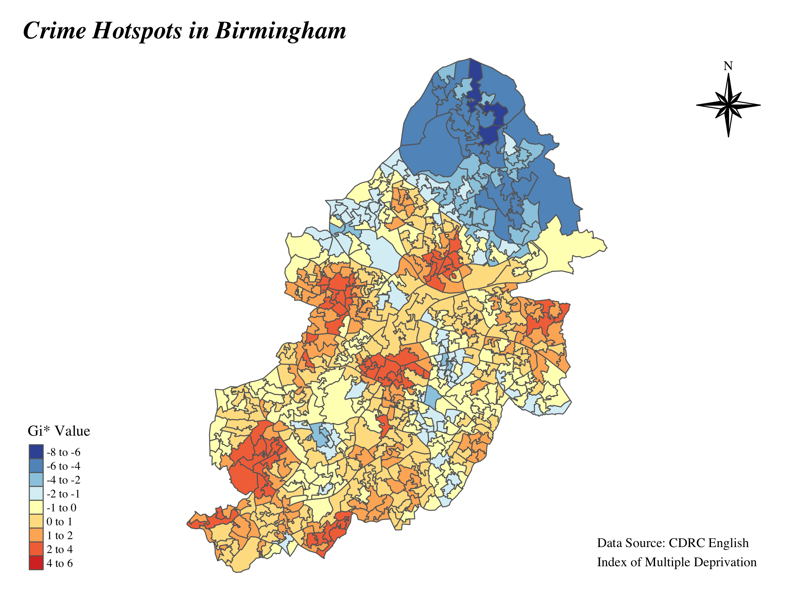
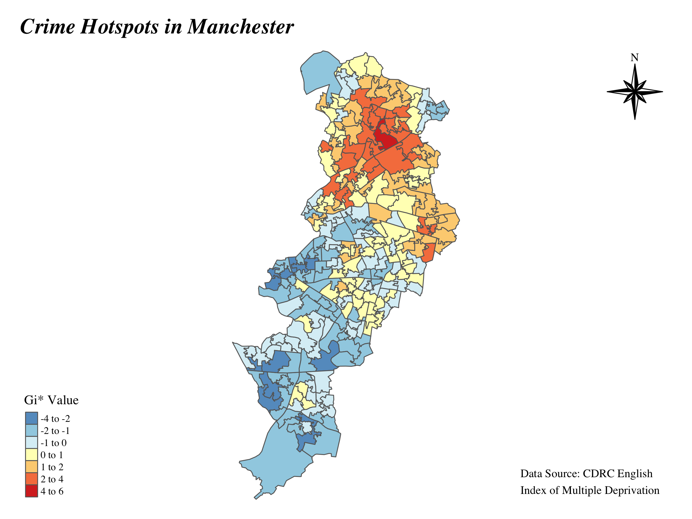

# Spatial Analysis of Crime Data

This project conducts spatial analysis on crime data from the **Index of Multiple Deprivation (IMD) 2019** dataset for three major UK cities: **London**, **Birmingham**, and **Manchester**. The analysis includes the identification of crime hotspots, multicollinearity checks, and the use of spatial autocorrelation tests.

## Visualisations from Project

#### London Crime Hotspots

#### Birmingham Crime Hotspots

#### Manchester Crime Hotspots

